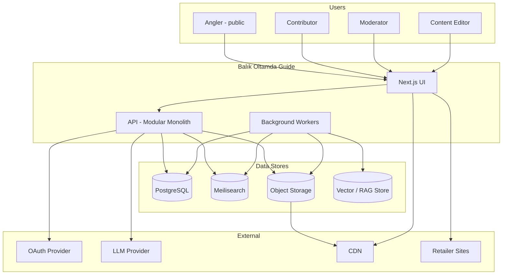
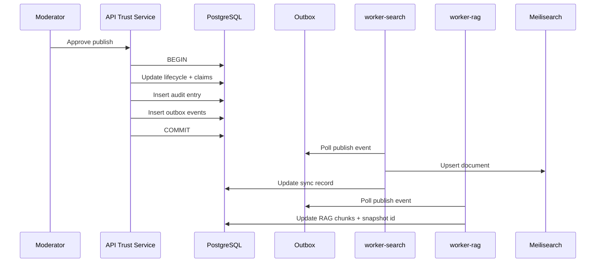
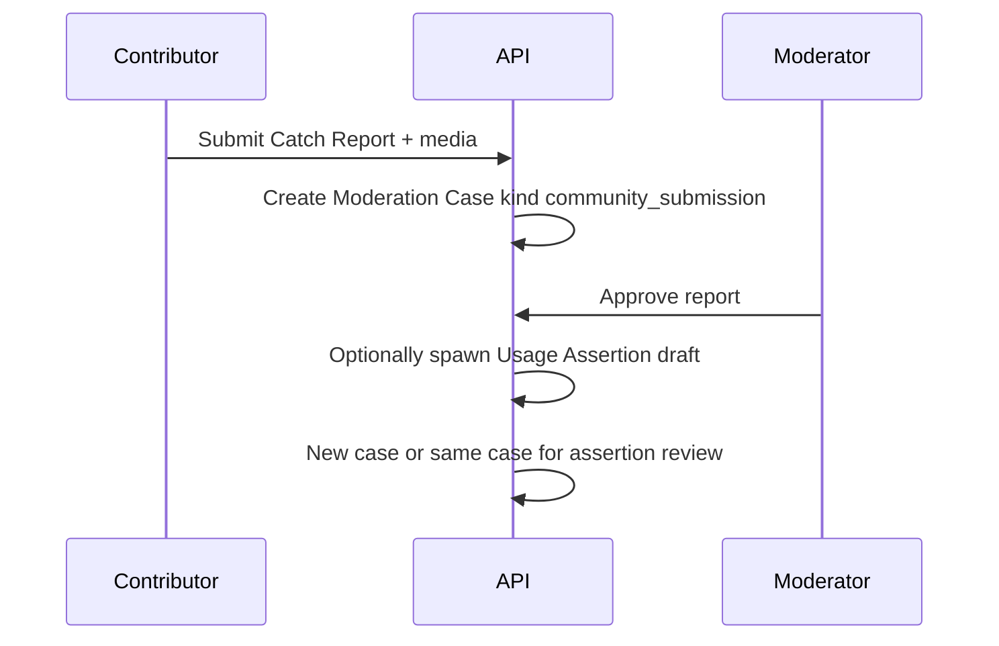

# System Architecture

**Document:** 006_SYSTEM_ARCHITECTURE  
**Project (internal):** TrollMatch  
**Platform (public):** Balık Oltamda Guide  
**Status:** Architecture baseline (target)  
**Companion docs:** `004_DECISIONS.md`, `007_DATABASE_VISION.md`, `008_TECH_STACK.md`

**Current implementation:** [`AI_CONTEXT.md`](../AI_CONTEXT.md) § Architecture. This document describes **target** C4 diagrams, deployment topology, and module boundaries.

---

## 1. Architectural Goals

| Goal | Mechanism |
|------|-----------|
| Data quality | Knowledge Claim + publish gates + typed moderation |
| Modular growth | Schema namespaces, module API prefixes, event hooks |
| Read scalability | Search index + CDN + HTTP cache on public catalog |
| Trust transparency | Provenance vs verification separation; citation graph for AI |
| Editorial independence | Sponsored links outside ranking; retail decoupled |
| Bilingual correctness | Locale indexes, Localized Text fallbacks, Turkish collation |

---

## 2. System Context (C4 Level 1)



**Note:** Retailer sites reached only via Sponsored Link redirect endpoint—no checkout in Guide.

---

## 3. Container View (C4 Level 2)

| Container | Technology | Responsibility |
|-----------|------------|----------------|
| **ui** | Next.js 15 App Router | Public guide, contributor forms, moderator console |
| **api** | Node.js + TypeScript HTTP server | REST `/v1`, auth, domain services, outbox write |
| **worker-search** | Node.js consumer | Meilisearch upsert/delete from outbox |
| **worker-rag** | Node.js consumer | Chunk published content; update corpus snapshot |
| **worker-media** | Node.js consumer | Image derivatives, fingerprint, virus scan hook |
| **postgres** | PostgreSQL 16 | System of record, outbox, audit |
| **meilisearch** | Meilisearch | Faceted public search per locale |
| **object-storage** | S3-compatible | Media originals + public derivatives |
| **reverse-proxy** | Caddy/Nginx | TLS, gzip, rate limit edge |

Initial deployment: **Docker Compose** on single VPS (ADR-015); workers may share process with api in earliest dev, separate containers before staging.

---

## 4. Module Boundaries

### 4.1 API Namespace Layout

```
api/src/
  platform/          # L0–L3, L7–L10 shared services
    identity/
    i18n/
    trust/           # claims, provenance, verification
    taxonomy/
    geography/
    moderation/
    media/
    search/          # index client, not Meilisearch itself
    ai/
    commerce/        # sponsored links only
    outbox/
  modules/
    lure-atlas/      # L4 LureAtlas aggregates + routes
    species-compass/ # stub until Phase 2
    technique-library/
  shared/            # types, zod schemas, locale utils
```

### 4.2 Route Prefixes

| Module | Public read | Authenticated write |
|--------|-------------|---------------------|
| Platform | `/v1/platform/...` | `/v1/platform/...` |
| LureAtlas | `/v1/lure-atlas/...` | `/v1/lure-atlas/...` |
| Moderation | — | `/v1/moderation/...` |
| AI | `/v1/ai/...` (flagged) | `/v1/ai/...` |

### 4.3 Database Schema Namespaces

| Schema | Owner |
|--------|-------|
| `platform` | Identity, taxonomy, geography, trust, moderation, outbox, commerce |
| `lure_atlas` | Manufacturer through Catch Report |
| `audit` | Optional partition for Audit Log Entry heavy append |

Cross-schema references use **Platform Canonical Identifier** (UUID)—no FK from `lure_atlas` to `lure_atlas` only; platform ids referenced by uuid column without cross-schema FK enforced in v1 migrations if tooling friction—documented in migration comments, logical integrity in services.

---

## 5. Core Domain Services (Platform)

### 5.1 Trust Service

- Create/update **Knowledge Claim** with **Provenance Attribution**
- Apply **Verification Event** on moderator approval
- Run **Publish Requirement Rule** via **Data Quality Assessment**
- Emit `entity.published` / `entity.deprecated` to outbox

### 5.2 Lifecycle Service

- Enforce Content Lifecycle State transitions (no ad hoc SQL updates)
- Write **Audit Log Entry** on every transition
- Block publish if Localized Text required locales missing (configurable per entity type)

### 5.3 Moderation Service

- Create **Moderation Case** by kind; attach subjects via **Moderation Case Subject Link**
- SLA timestamps; assignee; resolution → Trust Service or Merge Service
- Appeal and Dispute workflows reuse case infrastructure

### 5.4 i18n Service

- Resolve Localized Text with fallback chain (`007` §4.6)
- Queue **Translation Job**; attach **AI Suggestion** drafts for moderator

### 5.5 Media Service

- Signed upload URL → private bucket
- **worker-media** produces derivatives; writes **Media Fingerprint**
- Publish blocked until **Media License** + alt Localized Text present

### 5.6 Search Projection Service

- Maps published LureAtlas Model → Meilisearch document (per locale)
- Denormalizes taxonomy labels, synonyms, key claims, community summary counts
- Updates **Search Index Sync Record**

### 5.7 AI Orchestration Service

- Loads **Prompt Template** by id; calls provider adapter (ADR-012)
- Retrieves chunks from RAG store built from published claims + articles
- Persists **AI Assistant Session**, **AI Response Segment**, **Retrieval Citation Link**
- Never writes canonical claims without Verification Event path

### 5.8 Commerce Service

- Resolves **Sponsored Link** for variant + user country + placement slot
- Validates **Disclosure Policy Version** at render time
- Appends **Sponsored Click Ledger Entry** on redirect endpoint hit
- **No** ranking hooks

---

## 6. LureAtlas Module Services

| Service | Responsibility |
|---------|----------------|
| CatalogService | CRUD Model/Variant; deprecated merge survivor |
| IngestionService | Ingestion Batch; External Identifier Registry idempotency |
| AssociationService | Entity Association Link with kind enforcement |
| AssertionService | Usage Assertion, Catch Report, derivation hash rules |
| ComparisonService | Bounded 4-model aggregate read |
| RiggingService | Rigging Tip, Rig Configuration Template references |

---

## 7. Key Data Flows

### 7.1 Publish LureAtlas Model



### 7.2 Community Catch Report



### 7.3 Public Search Request

```
Client → GET /v1/lure-atlas/models?species=&technique=&locale=
       → API validates filters
       → Meilisearch query (locale index)
       → Returns cursor page of model summaries (no pending entities)
```

Organic sort keys: relevance, community signal summary, verification recency—not sponsored flags.

### 7.4 AI Discovery (Feature-Flagged)

```
Client → POST /v1/ai/sessions
       → AI Orchestration retrieves corpus snapshot id
       → Provider generates segments with citation links to claim ids
       → Client renders citations; low confidence → link to faceted browse
```

---

## 8. Discovery Projections (L9)

| Projection | Source | Update trigger |
|------------|--------|----------------|
| Meilisearch document | Published models, synonyms, summaries | Outbox `lure_atlas.model.published` |
| RAG chunk index | Published claims, Localized Text, TechniqueLibrary later | Same outbox + module-specific handlers |
| Vote Aggregation Snapshot | Community Vote inserts | Async worker debounced |
| LocationInsights Aggregate | Published Catch Reports | Batch job (future module) |

**Lag SLO (staging/prod):** search index sync **< 60 seconds** P95 after publish; RAG **< 5 minutes** P95 acceptable for beta.

---

## 9. Security Architecture

| Layer | Control |
|-------|---------|
| Edge | TLS 1.2+, rate limit auth/AI/submit endpoints |
| API | RBAC middleware; moderator routes separate permission |
| Data | PII minimal; contributor email not public |
| Media | Signed upload; EXIF strip default; MIME allowlist |
| AI | No contributor PII in prompts; token budgets |
| Audit | Append-only; admin compensating entries only |

Secrets in environment variables—never in repository. See `002_ENGINEERING_PRINCIPLES.md` §5.

---

## 10. Deployment Architecture

### 10.1 Environments

| Env | Purpose | Data |
|-----|---------|------|
| development | Local docker compose | Seed + synthetic |
| staging | Pre-prod integration | Anonymized subset + full schema |
| production | guide.balikoltamda.net | Live |

### 10.2 Production Topology (Initial)

```
Internet → Reverse Proxy (TLS)
              ├── ui:3000 (Next.js)
              ├── api:4000 (REST)
              └── static/CDN origin → object storage public bucket

Internal network:
  postgres:5432
  meilisearch:7700
  workers → postgres + meilisearch + object storage + LLM API
```

Retail PrestaShop remains on separate host/process (ADR-015).

### 10.3 Health Checks

- **api** `/health/live`, `/health/ready` (postgres + meilisearch ping)
- **workers** heartbeat row in postgres or queue depth alert
- **ui** static build health via deployment probe

---

## 11. Observability

| Signal | Tooling (see `008`) |
|--------|---------------------|
| Structured logs | JSON to stdout; request id correlation |
| Errors | Sentry or equivalent |
| Metrics | Publish lag, moderation queue depth, AI token spend |
| Traces | OpenTelemetry optional Phase 2 |

Alerting: outbox backlog age, search sync failures, media processing DLQ.

---

## 12. Repository ↔ Runtime Mapping

| Path | Runtime |
|------|---------|
| `ui/` | Next.js container |
| `api/` | API + optional in-process workers (dev) |
| `database/migrations/` | Flyway/node-pg-migrate job on deploy |
| `database/seeds/` | Manual/CI seed jobs |
| `research/` | Not deployed—ingestion CLI only |

---

## 13. Future Evolution Triggers

| Trigger | Action |
|---------|--------|
| LureAtlas CPU > 40% sustained | Split worker pool; consider read replicas |
| Independent module release cadence blocked twice | Extract module to separate deploy unit |
| Partner API traffic | API gateway + rate limit tier |
| Multi-region RPO/RTO requirement | ADR for replicated postgres + CDN multi-origin |

---

## 14. Explicit Non-Components

- Shopping cart, payment gateway, inventory service  
- Shared PrestaShop database connection  
- Unmoderated wiki write path  
- Production read of `research/` directory  

---

*Architecture baseline ratified Sprint 0. Changes require ADR in `004_DECISIONS.md`.*
