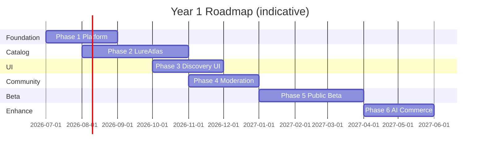

# Roadmap

**Document:** 009_ROADMAP  
**Project (internal):** TrollMatch  
**Platform (public):** Balık Oltamda Guide  
**Status:** Sprint 0 — Multi-phase roadmap  
**Horizon:** Year 1 public beta through Year 3 global platform  
**Backlog detail:** `005_BACKLOG.md`

---

## 1. Roadmap Principles

- **LureAtlas first** — proves catalog, trust, moderation, search, bilingual UX.
- **Platform kernel before module features** — identity, claims, outbox, taxonomy.
- **Data quality gates before growth** — 500 curated lures bar (G1) is a quality bar, not a count-for-SEO bar.
- **AI and sponsorship follow trust** — feature-flagged after core browse/compare/contribute works.
- **Modules extend shared ontology** — SpeciesCompass and TechniqueLibrary reuse platform ids.

---

## 2. Phase Overview

| Phase | Name | Duration (indicative) | Outcome |
|-------|------|----------------------|---------|
| **0** | Documentation & architecture | Complete at Sprint 0 | Charter stack ratified |
| **1** | Platform foundation | Sprints 1–2 | Kernel DB, auth, taxonomy seed, outbox |
| **2** | LureAtlas catalog | Sprints 3–5 | Ingestion, models, media, search API |
| **3** | Public discovery UI | Sprints 6–7 | tr/en browse, detail, compare |
| **4** | Community & moderation | Sprints 8–9 | Reports, assertions, queues, reputation |
| **5** | Beta hardening | Sprint 10–12 | G1–G5 exit, staging prod |
| **6** | AI & ethical commerce | Post-beta Q2 | RAG assistant, sponsor links (flagged) |
| **7** | Module expansion | Year 2 | SpeciesCompass, TechniqueLibrary |
| **8** | Expert & partners | Year 2–3 | Expert program, partner API |

---

## 3. Phase 0 — Sprint 0 (Complete)

**Objective:** Align product, engineering, data model, architecture, stack, backlog.

**Deliverables:**

- [x] `001_PROJECT_CHARTER.md`
- [x] `002_ENGINEERING_PRINCIPLES.md` (referenced; maintain parity)
- [x] `003_MASTER_CONTEXT.md`
- [x] `004_DECISIONS.md` (ADR-001–015)
- [x] `005_BACKLOG.md`
- [x] `006_SYSTEM_ARCHITECTURE.md`
- [x] `007_DATABASE_VISION.md`
- [x] `008_TECH_STACK.md`
- [x] `009_ROADMAP.md`
- [x] `010_CURSOR_RULES.md`
- [ ] `000_DISCOVERY.md` — ongoing market research (living)
- [ ] `011_GLOSSARY.md` — populate during Sprint 1 (BL-088)

**Exit gate:** Product owner approves Sprint 1 start per charter §20.

---

## 4. Phase 1 — Platform Foundation (Sprints 1–2)

**Objective:** Runnable monorepo; platform schema; auth; taxonomy geography seeds; outbox proof.

**Key backlog:** BL-001 through BL-014

**Milestones:**

| Milestone | Criteria |
|-----------|----------|
| M1.1 | CI green on lint + typecheck |
| M1.2 | Migrations apply on clean DB |
| M1.3 | User registration + login works locally |
| M1.4 | 500 species + core techniques seeded |
| M1.5 | Outbox event consumed in test worker |

**Risks:** Turkish collation misconfiguration—mitigate with ADR-011 tests early.

---

## 5. Phase 2 — LureAtlas Catalog (Sprints 3–5)

**Objective:** Manufacturer ingestion to published LureAtlas Models with claims, variants, associations.

**Key backlog:** BL-020 through BL-028, BL-030–BL-031

**Milestones:**

| Milestone | Criteria |
|-----------|----------|
| M2.1 | First manufacturer batch ingested idempotently |
| M2.2 | Publish Requirement Rules block incomplete models |
| M2.3 | Entity merge of duplicate test models |
| M2.4 | 100 published models internal dogfood |
| M2.5 | Media pipeline attaches licensed hero image |

---

## 6. Phase 3 — Public Discovery UI (Sprints 6–7)

**Objective:** Anglers browse, filter, view detail, compare—in Turkish and English.

**Key backlog:** BL-032–BL-037, BL-040–BL-045

**Milestones:**

| Milestone | Criteria |
|-----------|----------|
| M3.1 | Meilisearch faceted search live in UI |
| M3.2 | Lure detail shows provenance ladder correctly |
| M3.3 | Compare 4 models shareable URL |
| M3.4 | hreflang + core SEO metadata present |
| M3.5 | LCP smoke within engineering budget on staging |

---

## 7. Phase 4 — Community & Moderation (Sprints 8–9)

**Objective:** Contributors submit; moderators resolve within SLA target.

**Key backlog:** BL-050–BL-060

**Milestones:**

| Milestone | Criteria |
|-----------|----------|
| M4.1 | Catch report → optional assertion derivation |
| M4.2 | Correction request distinct queue |
| M4.3 | Median moderation time measured on staging |
| M4.4 | Reputation events on accept/reject |
| M4.5 | Abuse report + basic sanction |

**Staffing note:** 72h median SLA (G3) requires assigned moderators before public beta marketing—not only software.

---

## 8. Phase 5 — Public Beta (Sprints 10–12)

**Objective:** Meet charter Year 1 goals G1–G5 on staging then production.

**Key backlog:** BL-080–BL-087

**Charter exit checklist:**

| Goal | Target |
|------|--------|
| G1 | ≥500 published LureAtlas Models, quality assessment pass |
| G2 | ≥95% UI strings tr/en; core entities both locales |
| G3 | Contributor flow live; moderation SLA instrumented |
| G4 | 100% published claims attributed |
| G5 | Second module (SpeciesCompass) scoped without schema break demo |

**Launch:** `guide.balikoltamda.net` production deploy; soft launch to Balık Oltamda audience + international SEO gradual indexation.

---

## 9. Phase 6 — AI & Ethical Commerce (Post-Beta, Year 1 Q2)

**Objective:** Optional differentiators without compromising trust.

**Key backlog:** BL-070–BL-077

**Milestones:**

| Milestone | Criteria |
|-----------|----------|
| M6.1 | RAG assistant with citation links on staging |
| M6.2 | AI discovery behind feature flag default off until review |
| M6.3 | Moderator copilot reduces duplicate review time (measure) |
| M6.4 | Sponsored links in placement slots only; disclosure policy versioned |
| M6.5 | Click ledger reconciles with sponsor reports |

**Dependency:** TechniqueLibrary minimal article set OR LureAtlas-only corpus explicitly scoped in product messaging until articles ship.

---

## 10. Phase 7 — Module Expansion (Year 2)

**Objective:** SpeciesCompass and TechniqueLibrary MVPs on shared taxonomy.

| Module | Deliverable |
|--------|-------------|
| SpeciesCompass Extension | Seasonality, habitat, conservation narrative per Fish Species |
| TechniqueLibrary Article | Long-form technique content; RAG partition |
| LocationInsights Aggregate | Anonymized catch pattern dashboards |

**Prerequisite:** LureAtlas moderation and ingestion stable; module registry pattern proven.

---

## 11. Phase 8 — Expert Program & Partners (Year 2–3)

**Objective:** Credentialed verification and B2B read API.

- Expert Profile + Conflict of Interest Declaration + Expert Endorsement pilot
- Conservation Rule Reference expansion per country
- Partner API tier with rate limits and attribution requirements
- Optional mobile wrapper evaluation (not committed)

---

## 12. Cross-Phase Dependencies

Dates indicative—actual sprint velocity governs.

---

## 13. Success Metrics by Phase

| Phase | North star proxy |
|-------|------------------|
| 3 | Internal team completes discovery session without moderator help |
| 5 | MAU return within 30 days after meaningful session (charter §22) |
| 5 | Search success: click in top 3 results > 60% |
| 6 | AI escalation to browse < 40% of AI sessions |
| 7 | SpeciesCompass pages indexed with cross-links from lure pages |

---

## 14. Out of Roadmap (Charter Non-Goals)

- E-commerce checkout on Guide  
- Native mobile apps (Year 1)  
- Automated legal bag-limit engine  
- Unmoderated community wiki  

---

## 15. Review Cadence

- **Sprint review:** backlog reprioritization  
- **Quarterly:** roadmap phase adjustment with product owner  
- **Charter amendment:** required for scope leaving fishing knowledge platform  

---

*Roadmap ratified Sprint 0. Phase 1 starts upon product owner approval.*
